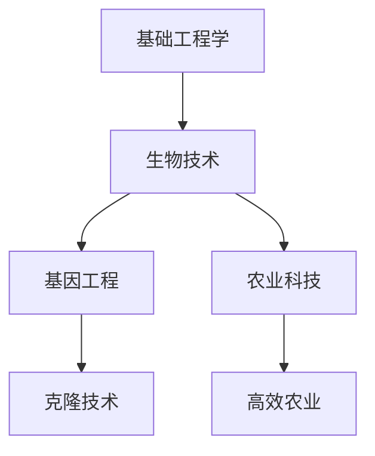

# 🌳 科技树扩展完整教程

## 目录
1. [准备工作](#准备工作)
2. [基础概念](#基础概念)
3. [实战案例：添加"生物技术"分支](#实战案例添加生物技术分支)
4. [高级技巧](#高级技巧)
5. [测试与调试](#测试与调试)
6. [最佳实践](#最佳实践)

---

## 准备工作

### 📋 需要修改的文件清单
```
src/
├── types/index.ts              # 类型定义
├── data/initialState.ts        # 科技数据
├── hooks/useGameState.ts       # 房间配置
├── components/
│   ├── RoomPanel.tsx           # 房间UI
│   ├── TechnologyPanel.tsx     # 科技UI
│   └── ResidentPanel.tsx       # 居民UI
└── utils/gameLogic.ts          # 游戏逻辑
```

### 🎯 扩展目标
我们将添加一个**生物技术**分支，包含：
- 新科技：生物技术、基因工程、克隆技术
- 新房间：温室、基因实验室、克隆舱
- 新效果：食物产量提升、居民属性增强

---

## 基础概念

### 科技数据结构
```typescript
interface Technology {
  id: string;           // 科技ID
  name: string;         // 显示名称
  description: string;  // 描述
  cost: Partial<Resources>;      // 研究成本
  researchTime: number;          // 研究时间
  requirements: string[];        // 前置科技
  unlocks: string[];            // 解锁内容
  effects: TechEffect[];        // 科技效果
  isResearched: boolean;        // 是否已研究
  isResearching: boolean;       // 是否正在研究
  progress: number;             // 研究进度
}
```

### 科技效果类型
```typescript
type TechEffectType = 
  | 'unlock_room'         // 解锁房间
  | 'unlock_upgrade'      // 解锁升级
  | 'production_bonus'    // 生产加成
  | 'resource_efficiency' // 资源效率
  | 'unlock_tech';        // 解锁科技
```

---

## 实战案例：添加"生物技术"分支

### 步骤1：设计科技树结构



### 步骤2：添加新房间类型

**修改 `src/types/index.ts`**
```typescript
export type RoomType = 
  | 'farm'
  | 'water_plant'
  // ... 现有房间类型
  | 'greenhouse'        // 温室
  | 'gene_lab'         // 基因实验室
  | 'clone_chamber'    // 克隆舱
  | 'hydroponic_farm'; // 水培农场
```

### 步骤3：添加科技定义

**修改 `src/data/initialState.ts`**

在 `technologies` 数组中添加：

```typescript
// 在technologies数组中添加以下科技
{
  id: 'biotechnology',
  name: '生物技术',
  description: '解锁生物相关设施，提升食物生产效率',
  cost: { research: 150, chemicals: 20 },
  researchTime: 80,
  requirements: ['basic_engineering'],
  unlocks: ['greenhouse'],
  effects: [
    { type: 'unlock_room', target: 'greenhouse', value: 1 },
    { type: 'production_bonus', target: 'food', value: 0.2 },
    { type: 'unlock_upgrade', target: 'farm', value: 3 },
  ],
  isResearched: false,
  isResearching: false,
  progress: 0,
},
{
  id: 'genetic_engineering',
  name: '基因工程',
  description: '解锁基因实验室，可以改造居民基因',
  cost: { research: 300, chemicals: 50, components: 30 },
  researchTime: 120,
  requirements: ['biotechnology'],
  unlocks: ['gene_lab'],
  effects: [
    { type: 'unlock_room', target: 'gene_lab', value: 1 },
    { type: 'production_bonus', target: 'chemicals', value: 0.3 },
  ],
  isResearched: false,
  isResearching: false,
  progress: 0,
},
{
  id: 'agricultural_tech',
  name: '农业科技',
  description: '解锁先进农业设施',
  cost: { research: 200, materials: 80 },
  researchTime: 90,
  requirements: ['biotechnology'],
  unlocks: ['hydroponic_farm'],
  effects: [
    { type: 'unlock_room', target: 'hydroponic_farm', value: 1 },
    { type: 'production_bonus', target: 'food', value: 0.4 },
  ],
  isResearched: false,
  isResearching: false,
  progress: 0,
},
{
  id: 'cloning_technology',
  name: '克隆技术',
  description: '解锁克隆舱，可以培育新居民',
  cost: { research: 500, chemicals: 100, components: 80 },
  researchTime: 180,
  requirements: ['genetic_engineering'],
  unlocks: ['clone_chamber'],
  effects: [
    { type: 'unlock_room', target: 'clone_chamber', value: 1 },
  ],
  isResearched: false,
  isResearching: false,
  progress: 0,
},
```

### 步骤4：添加升级解锁配置

**在 `src/data/initialState.ts` 的 `unlockedUpgrades` 中添加：**

```typescript
unlockedUpgrades: {
  // ... 现有配置
  greenhouse: 1,
  gene_lab: 1,
  clone_chamber: 1,
  hydroponic_farm: 1,
},
```

### 步骤5：添加房间数据配置

**修改 `src/hooks/useGameState.ts` 的 `getRoomData` 函数：**

```typescript
const getRoomData = (roomType: Room['type']) => {
  const roomConfigs = {
    // ... 现有房间配置
    
    greenhouse: {
      maxWorkers: 3,
      production: { resource: 'food' as const, rate: 1.5 },
      cost: { materials: 120, components: 20, chemicals: 10 },
      upgradeCost: { materials: 240, components: 40, chemicals: 20 },
      buildTime: 30,
    },
    
    gene_lab: {
      maxWorkers: 2,
      production: { resource: 'chemicals' as const, rate: 0.8 },
      cost: { materials: 200, components: 50, chemicals: 30 },
      upgradeCost: { materials: 400, components: 100, chemicals: 60 },
      buildTime: 45,
    },
    
    clone_chamber: {
      maxWorkers: 1,
      production: { resource: 'research' as const, rate: 0.3 },
      cost: { materials: 500, components: 100, chemicals: 80, money: 1000 },
      upgradeCost: { materials: 1000, components: 200, chemicals: 160, money: 2000 },
      buildTime: 60,
    },
    
    hydroponic_farm: {
      maxWorkers: 4,
      production: { resource: 'food' as const, rate: 2.0 },
      cost: { materials: 300, components: 50, power: 100 },
      upgradeCost: { materials: 600, components: 100, power: 200 },
      buildTime: 40,
    },
  };
  
  return roomConfigs[roomType];
};
```

### 步骤6：更新UI显示

**修改 `src/components/RoomPanel.tsx`：**

```typescript
// 在roomTypes数组中添加
const roomTypes = [
  // ... 现有房间类型
  { type: 'greenhouse', name: '温室', icon: '🌱', description: '高效食物生产设施', category: '资源生产' },
  { type: 'gene_lab', name: '基因实验室', icon: '🧬', description: '基因研究和化学品生产', category: '功能设施' },
  { type: 'clone_chamber', name: '克隆舱', icon: '🧪', description: '培育新居民的高级设施', category: '功能设施' },
  { type: 'hydroponic_farm', name: '水培农场', icon: '🌿', description: '无土栽培，高效食物生产', category: '资源生产' },
];

// 在getRelevantSkill函数中添加
const getRelevantSkill = (roomType: Room['type'], resident: Resident): number => {
  const skillMapping = {
    // ... 现有映射
    greenhouse: resident.skills.management,
    gene_lab: resident.skills.research,
    clone_chamber: resident.skills.medical,
    hydroponic_farm: resident.skills.engineering,
  };
  return skillMapping[roomType] || 1;
};

// 在getRoomCost函数中添加
const getRoomCost = (roomType: RoomType): Partial<Resources> => {
  const costs = {
    // ... 现有成本
    greenhouse: { materials: 120, components: 20, chemicals: 10 },
    gene_lab: { materials: 200, components: 50, chemicals: 30 },
    clone_chamber: { materials: 500, components: 100, chemicals: 80, money: 1000 },
    hydroponic_farm: { materials: 300, components: 50, power: 100 },
  };
  return costs[roomType];
};
```

### 步骤7：更新其他UI组件

**修改 `src/components/TechnologyPanel.tsx`：**

```typescript
const getRoomName = (roomType: string): string => {
  const names: Record<string, string> = {
    // ... 现有名称
    greenhouse: '温室',
    gene_lab: '基因实验室', 
    clone_chamber: '克隆舱',
    hydroponic_farm: '水培农场',
  };
  return names[roomType] || roomType;
};
```

**修改 `src/components/ResidentPanel.tsx`：**

```typescript
// 在getRelevantSkill和getRoomName函数中添加相同的映射
const getRelevantSkill = (roomType: Room['type'], resident: Resident): number => {
  const skillMapping = {
    // ... 现有映射
    greenhouse: resident.skills.management,
    gene_lab: resident.skills.research,
    clone_chamber: resident.skills.medical,
    hydroponic_farm: resident.skills.engineering,
  };
  return skillMapping[roomType] || 1;
};

const getRoomName = (roomType: Room['type']) => {
  const names = {
    // ... 现有名称
    greenhouse: '温室',
    gene_lab: '基因实验室',
    clone_chamber: '克隆舱',
    hydroponic_farm: '水培农场',
  };
  return names[roomType];
};
```

### 步骤8：更新游戏逻辑

**修改 `src/utils/gameLogic.ts`：**

```typescript
// 在getRelevantSkill函数中添加
export const getRelevantSkill = (roomType: Room['type'], resident: Resident): number => {
  const skillMapping = {
    // ... 现有映射
    greenhouse: resident.skills.management,
    gene_lab: resident.skills.research,
    clone_chamber: resident.skills.medical,
    hydroponic_farm: resident.skills.engineering,
  };
  return skillMapping[roomType] || 1;
};

// 在getRoomPowerConsumption函数中添加
export const getRoomPowerConsumption = (roomType: RoomType): number => {
  const powerConsumption = {
    // ... 现有消耗
    greenhouse: 0.08,
    gene_lab: 0.12,
    clone_chamber: 0.15,
    hydroponic_farm: 0.10,
  };
  return powerConsumption[roomType] || 0;
};
```

---

## 高级技巧

### 1. **科技效果系统扩展**

**添加新的效果类型：**

```typescript
// 在types/index.ts中扩展
export interface TechEffect {
  type: 'production_bonus' | 'resource_efficiency' | 'unlock_room' | 'unlock_tech' | 'unlock_upgrade' 
       | 'resident_bonus' | 'building_speed' | 'cost_reduction' | 'storage_increase';
  target: string;
  value: number;
  condition?: string; // 可选条件
}
```

**在useGameState.ts中处理新效果：**

```typescript
// 在科技完成处理中添加
completedTech.effects.forEach(effect => {
  switch (effect.type) {
    case 'resident_bonus':
      // 处理居民属性加成
      break;
    case 'building_speed':
      // 处理建造速度加成
      break;
    case 'cost_reduction':
      // 处理成本减少
      break;
    case 'storage_increase':
      // 处理存储上限增加
      break;
  }
});
```

### 2. **条件性科技解锁**

```typescript
{
  id: 'emergency_protocol',
  name: '紧急协议',
  description: '在资源短缺时解锁',
  cost: { research: 100 },
  researchTime: 30,
  requirements: ['basic_engineering'],
  unlocks: ['emergency_generator'],
  effects: [
    { type: 'unlock_room', target: 'emergency_generator', value: 1 },
  ],
  // 添加解锁条件
  unlockCondition: {
    type: 'resource_shortage',
    resource: 'power',
    threshold: 10,
  },
  isResearched: false,
  isResearching: false,
  progress: 0,
}
```

### 3. **科技分支互斥**

```typescript
{
  id: 'military_path',
  name: '军事路线',
  description: '选择军事发展路线',
  cost: { research: 200 },
  researchTime: 60,
  requirements: ['combat_training'],
  unlocks: ['fortress', 'weapon_factory'],
  effects: [
    { type: 'unlock_room', target: 'fortress', value: 1 },
    { type: 'unlock_room', target: 'weapon_factory', value: 1 },
  ],
  // 与和平路线互斥
  conflictsWith: ['peaceful_path'],
  isResearched: false,
  isResearching: false,
  progress: 0,
}
```

---

## 测试与调试

### 1. **构建测试**

```bash
npm run build
```

### 2. **功能测试清单**

- [ ] 科技树显示正确
- [ ] 前置科技检查生效
- [ ] 房间正确解锁
- [ ] 升级上限正确应用
- [ ] 生产效率加成生效
- [ ] UI显示中文名称
- [ ] 技能映射正确
- [ ] 电力消耗计算正确

### 3. **调试技巧**

**在浏览器控制台查看游戏状态：**

```javascript
// 查看科技状态
console.log(gameState.technologies);

// 查看解锁的房间
console.log(gameState.unlockedRooms);

// 查看升级解锁状态
console.log(gameState.unlockedUpgrades);
```

**添加调试日志：**

```typescript
// 在useGameState.ts的科技完成处理中添加
if (completedTech) {
  console.log(`科技 ${completedTech.name} 研究完成`);
  console.log('解锁内容:', completedTech.unlocks);
  console.log('科技效果:', completedTech.effects);
}
```

---

## 最佳实践

### 1. **科技树设计原则**

- **渐进性**：科技成本和效果应该递进增长
- **选择性**：提供多种发展路径
- **平衡性**：避免某个科技过于强大
- **主题性**：科技应该有明确的主题分类

### 2. **命名规范**

```typescript
// 科技ID命名
'biotechnology'        // 小写，下划线分隔
'genetic_engineering'  // 描述性，清晰明了

// 房间类型命名
'greenhouse'           // 简洁，一目了然
'gene_lab'            // 缩写适当
'clone_chamber'       // 功能明确
```

### 3. **成本平衡**

```typescript
// 科技成本建议
const techCosts = {
  tier1: { research: 50-100 },   // 基础科技
  tier2: { research: 150-300 },  // 中级科技
  tier3: { research: 400-600 },  // 高级科技
  tier4: { research: 800-1200 }, // 顶级科技
};

// 房间成本建议
const roomCosts = {
  basic: { materials: 50-100 },     // 基础设施
  advanced: { materials: 150-300 }, // 高级设施
  endgame: { materials: 400-800 },  // 终极设施
};
```

### 4. **效果设计**

```typescript
// 生产加成建议
const productionBonus = {
  small: 0.1-0.2,   // 小幅提升
  medium: 0.3-0.5,  // 中等提升
  large: 0.6-1.0,   // 大幅提升
};

// 避免过度强化
const maxBonus = 2.0; // 最大200%加成
```

### 5. **用户体验**

- **清晰的科技描述**：让玩家明白科技的作用
- **视觉反馈**：科技完成时的通知
- **进度显示**：研究进度的实时更新
- **前置提示**：清楚显示科技的前置条件

---

## 🎯 完整检查清单

在发布新科技树之前，请确保：

- [ ] 所有新房间类型已添加到 `types/index.ts`
- [ ] 科技数据已添加到 `initialState.ts`
- [ ] 房间配置已添加到 `useGameState.ts`
- [ ] UI组件已更新中文显示
- [ ] 技能映射已正确配置
- [ ] 电力消耗已正确设置
- [ ] 成本配置已正确设置
- [ ] 构建无错误
- [ ] 功能测试通过
- [ ] 平衡性测试通过

---

## 🚀 快速开始模板

复制以下模板开始添加你的科技：

```typescript
// 1. 在types/index.ts中添加房间类型
export type RoomType = 
  | 'your_new_room'
  | /* ... existing types ... */;

// 2. 在initialState.ts中添加科技
{
  id: 'your_tech_id',
  name: '你的科技名称',
  description: '科技描述',
  cost: { research: 100 },
  researchTime: 60,
  requirements: ['basic_engineering'],
  unlocks: ['your_new_room'],
  effects: [
    { type: 'unlock_room', target: 'your_new_room', value: 1 },
  ],
  isResearched: false,
  isResearching: false,
  progress: 0,
},

// 3. 在useGameState.ts中添加房间配置
your_new_room: {
  maxWorkers: 2,
  production: { resource: 'food' as const, rate: 1.0 },
  cost: { materials: 100, components: 10 },
  upgradeCost: { materials: 200, components: 20 },
  buildTime: 30,
},

// 4. 在相关UI组件中添加显示名称和映射
```

通过这个完整的教程，你可以轻松地扩展科技树，添加任何你想要的科技分支和功能！

---

## 📝 更新日志

- **v1.0.0** - 初始版本，包含生物技术分支示例
- **v1.1.0** - 添加高级技巧和调试方法
- **v1.2.0** - 添加最佳实践和完整检查清单

---

## 🤝 贡献指南

欢迎为这个教程贡献内容！请确保：

1. 代码示例经过测试
2. 遵循现有的代码风格
3. 添加适当的注释
4. 更新相关的文档

---

*最后更新：2024年*